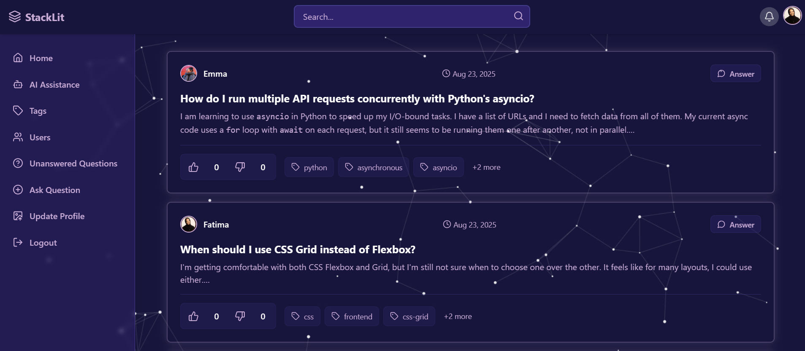
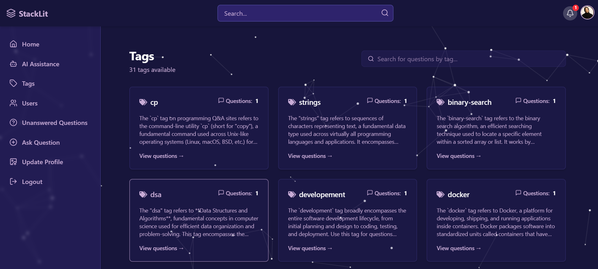
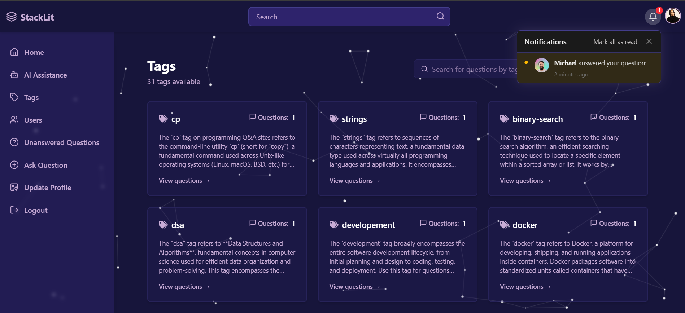
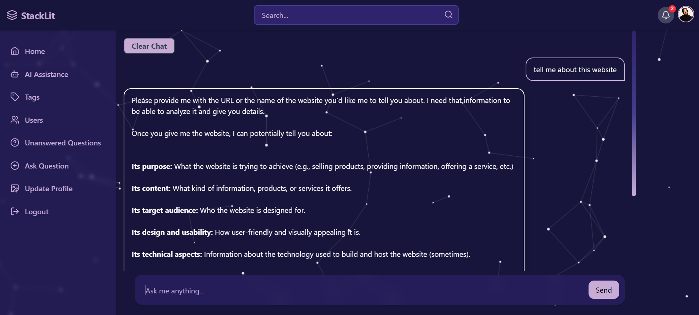
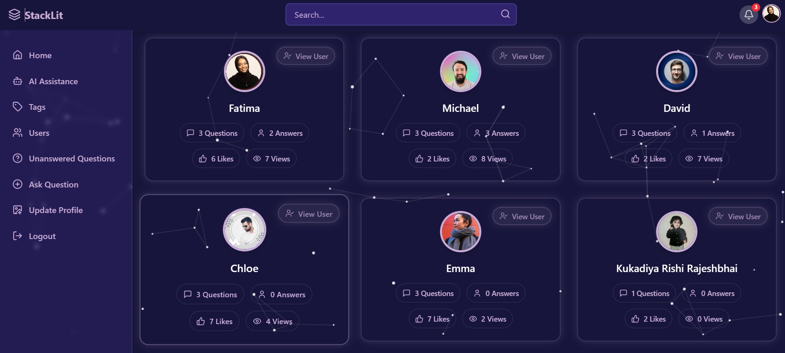
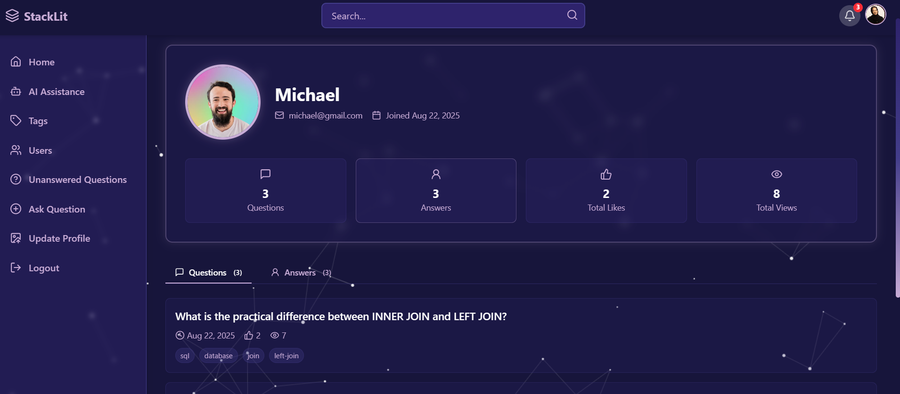
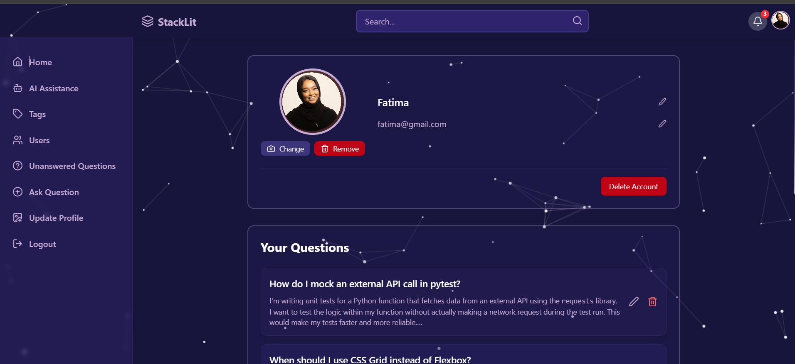

# StackLit 💡 — A Fullstack Q&A Platform

**StackLit** is a full-featured StackOverflow-style Q&A web application built using the **MERN stack**, allowing users to post questions, answer others, get real-time notifications, search users/questions/tags, and much more.

---

## 🚀 Live Demo

🌐 [https://stack-lit.vercel.app](https://stack-lit.vercel.app)

---

## 📸 Screenshots

Here are some example pages from the app:

| Home | Question Page | Ask Question |
|------|---------------|----------|
|  |  |  |

| Tags | Notifications | Ai Assistance |
|------|---------------|------|
|  |  |  |

| Users | Profile | Update Profile |
|--------|---------|-------------|
|  |  |  |

---

## 🛠️ Tech Stack

- **Frontend:** React, Tailwind CSS, Axios, React Router, Redux Toolkit
- **Backend:** Node.js, Express.js, MongoDB, Mongoose
- **Authentication:** JWT-based auth
- **Real-time:** Socket.IO (for notifications)
- **Editor:** Quill.js (rich text)
- **Storage:** Cloudinary (image upload)
- **Search:** Regex-based search for users/questions/tags
- **Other:** Vite, CORS, dotenv, express-async-handler

---

## ✨ Features

- ✅ Sign up / Login / JWT Auth
- ✅ Ask questions with tags, images, formatting
- ✅ View answers, post answers, like/dislike
- ✅ Live notifications for answers, likes/dislikes
- ✅ Search users, tags, and questions
- ✅ View user profile and stats
- ✅ Paginated questions, answers, and search results
- ✅ Mobile responsive UI

---

## 📄 License

This project is licensed under the MIT License.

---

### ⭐ Give a Star

If you like the project, don’t forget to ⭐ the repository!
